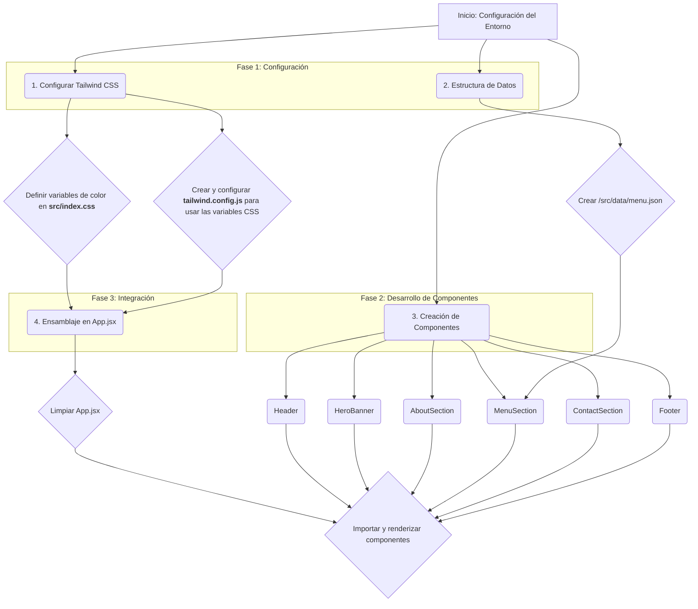

# Plan de Desarrollo: Página Web para Repostería

Este documento describe el plan para desarrollar una página web para una repostería utilizando React, Vite y Tailwind CSS.

## Diagrama del Flujo de Trabajo



---

## Detalles del Plan

### 1. Configuración de Tailwind CSS

- **Limpiar y Configurar `src/index.css`**:

  - Reemplazar el contenido actual con las directivas de Tailwind.
  - Añadir un bloque `:root` para definir la paleta de colores como variables CSS.

  ```css
  /* En src/index.css */
  @tailwind base;
  @tailwind components;
  @tailwind utilities;

  @layer base {
    :root {
      --color-1: #e24a2e;
      --color-2: #e97152;
      --color-3: #f19975;
      --color-4: #f8c099;
      --color-5: #ffe8bd;
    }
  }
  ```

- **Crear y Configurar `tailwind.config.js`**:
  - Crear el archivo en la raíz del proyecto.
  - Configurarlo para que reconozca las variables CSS definidas.
  ```javascript
  // En tailwind.config.js
  /** @type {import('tailwindcss').Config} */
  export default {
    content: ['./index.html', './src/**/*.{js,ts,jsx,tsx}'],
    theme: {
      extend: {
        colors: {
          color1: 'var(--color-1)',
          color2: 'var(--color-2)',
          color3: 'var(--color-3)',
          color4: 'var(--color-4)',
          color5: 'var(--color-5)',
        },
      },
    },
    plugins: [],
  };
  ```
- **Limpiar `src/App.css`**: Eliminar su contenido.

### 2. Estructura de Datos

- **Crear Directorio de Datos**: Crear la carpeta `/src/data`.
- **Crear `menu.json`**: Dentro de `/src/data`, crear el archivo `menu.json` con datos de ejemplo para las categorías del menú.

### 3. Creación de Componentes (Scaffolding)

- **Crear Directorio de Componentes**: Crear la carpeta `/src/components`.
- **Generar Archivos de Componentes**: Crear los archivos `.jsx` para cada componente (Header, HeroBanner, AboutSection, MenuSection, ContactSection, Footer, etc.).

### 4. Ensamblaje en `App.jsx`

- **Limpiar `App.jsx`**: Eliminar el código de demostración de Vite.
- **Importar y Renderizar Componentes**: Importar y organizar los componentes creados para formar la estructura de la página.
